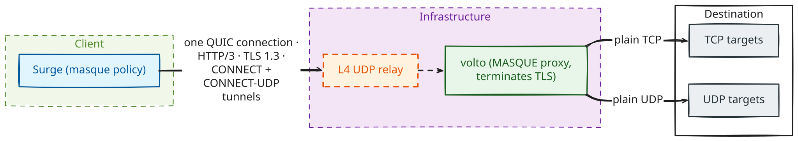

<div align="center">

# volto

**A MASQUE proxy server in Rust — HTTP/3 CONNECT and CONNECT-UDP over one QUIC connection, built for [Surge](https://nssurge.com)'s `masque` policy.**

[](https://github.com/vcarus/volto/actions/workflows/ci.yml)
[](https://github.com/vcarus/volto/releases/latest)
[](docs/deployment.md#building)
[](https://vcarus.github.io/volto/)
[](LICENSE)

[Quickstart](#quickstart) · [Features](#features) · [Compatibility](#compatibility) · [Documentation](#documentation) · [Testing](#testing)

</div>

---

The server terminates TLS, speaks HTTP/3 to the client and carries **TCP through classic CONNECT** (RFC 9114 §4.4) and **UDP through CONNECT-UDP** (RFC 9298, HTTP Datagrams per RFC 9297). Both paths matter: a server that only speaks CONNECT-UDP carries almost none of an ordinary client's traffic. It runs unattended on a small Linux host, reloads certificates and credentials on `SIGHUP`, and ships as a static binary.

<p align="center">
  <picture>
    <source media="(prefers-color-scheme: dark)" srcset="docs/assets/topology-dark.svg">
    
  </picture>
</p>

## Quickstart

### 1. One line on a fresh Ubuntu host

Downloads the newest release for the host's architecture, verifies it against `SHA256SUMS`, creates the system user, generates a self-signed certificate and a 144-bit password, writes `/etc/volto/config.toml`, installs the systemd unit and starts it. With `--enable-timer` the same script re-runs daily and upgrades in place, with automatic rollback if the new version fails to start.

```sh
curl -fsSL https://raw.githubusercontent.com/vcarus/volto/main/script/deploy.sh |
  sudo bash -s -- --enable-timer --username yourname
```

It finishes by printing a ready-to-paste Surge policy line:

```
volto = masque, 203.0.113.10, 443, sni=volto.internal, server-cert-fingerprint-sha256=AA:BB:…:FF, username=yourname, password=…
```

> **The fingerprint is the trust anchor.** Carry it to the client over a channel you trust and never replace it with `skip-cert-verify`: Basic credentials travel on every request, so a man in the middle collects them at once. For a public-CA certificate instead, see [docs/deployment.md](docs/deployment.md#certificates).

Everything the piped script installs comes out of the checksum-verified release tarball; the piped copy only steers. Details and every flag: [Deploying from releases](docs/deployment.md#deploying-from-releases).

### 2. From a release tarball

Static musl builds for `x86_64` and `aarch64` are on the [releases page](https://github.com/vcarus/volto/releases). Each archive unpacks to the binary, `script/` and `docs/`, so the installer runs straight out of it:

```sh
tar xzf volto-*-x86_64-unknown-linux-musl.tar.gz && cd volto-*/
sudo script/install-selfsigned.sh          # first install
sudo script/deploy.sh --enable-timer       # or: install + keep it updated
```

### 3. From source

Rust 1.95 or newer. `Cargo.lock` is committed and redirects `quinn-proto` to a patched commit, so always build `--locked` and never run a bare `cargo update` (why: [docs/architecture.md](docs/architecture.md#why-quinn-proto-is-patched-temporary)).

```sh
cargo build --release --locked             # target/release/volto
cargo run --locked -- --config config.toml # run by hand during development
```

A commented example configuration is [script/config.example.toml](script/config.example.toml); only `[server]` is required.

## Features

| Area | What you get |
|---|---|
| **Tunnels** | Classic CONNECT for TCP and CONNECT-UDP for UDP, dispatched by the `:protocol` pseudo-header on one QUIC connection. Full RFC 9114 §4.4 half-close, so protocols that depend on it survive the proxy. |
| **Capsules & datagrams** | RFC 9297 Capsule Protocol on the request stream; unknown capsules are skipped. QUIC DATAGRAM is the fast path, the DATAGRAM capsule the fallback when datagrams are unavailable. |
| **Authentication** | HTTP Basic on every CONNECT, compared in constant time; `Proxy-Authorization` and `Authorization` both accepted; 407 on failure, with a per-connection failure budget. |
| **Open-proxy defences** | Private, loopback and multicast ranges refused by default (IPv4-mapped bypasses included), port 25 denied, tunnels capped per connection, unanswered UDP sessions bounded, name-lookup budget per connection. |
| **QUIC transport** | Stream limits, idle timeout, keep-alive, initial MTU, PMTU probing, congestion controller (BBR by default) and initial RTT are configuration, not constants. |
| **Operations** | `SIGHUP` reload that rejects a bad configuration whole and keeps serving; graceful shutdown with GOAWAY and a grace period; systemd unit, installer and self-updating deploy script included. |
| **Diagnostics** | Per-request debug logging with redacted credentials, `SSLKEYLOGFILE` for frame-level analysis, and `--check-config`, which validates a file with the exact code path startup uses. |

**Explicit non-goals:** CONNECT-IP (RFC 9484), traffic obfuscation, and a web admin panel.

## Compatibility

| | |
|---|---|
| **Client** | Surge (iOS / macOS) `masque` policy. Auth is HTTP Basic; add `sni=` and `server-cert-verify-name=` when the server sits behind a relay IP. |
| **Server** | Linux (`x86_64`, `aarch64`); static musl binaries, no runtime dependencies. Listens on **UDP only**: open the QUIC port in your firewall, there is no TCP listener. |
| **Behind a relay** | Works behind a plain L4 UDP DNAT relay; TLS terminates only on volto. See [Running behind a UDP relay](docs/deployment.md#running-behind-a-udp-relay). |
| **Development** | macOS or Linux, Rust 1.95+. The test suite is green on both. |

## Documentation

| Page | What is in it |
|---|---|
| [The manual](https://vcarus.github.io/volto/) | The three pages below as one searchable book, rebuilt from `main` on every push. |
| [docs/configuration.md](docs/configuration.md) | Every key, its default, and what it costs to change. |
| [docs/deployment.md](docs/deployment.md) | Building, certificates (ACME DNS-01 or self-signed + pinning), releases and rollback, systemd, firewall, fd budget, reloads, relays, fail2ban. |
| [docs/architecture.md](docs/architecture.md) | How a request becomes a tunnel, the in-tree HTTP/3 layer, why quinn-proto is patched, what the tests assert. |
| [API docs](https://vcarus.github.io/volto/api/) | The crate's rustdoc, rebuilt from `main` on every push. |
| [SECURITY.md](SECURITY.md) | How to report a vulnerability privately. |

## Testing

```sh
cargo test --locked                                # unit + integration
cargo test --locked --test it_policy               # authentication / ACL / quotas
cargo test --locked --test it_stress -- --ignored  # heavy load tier
```

Integration tests assert on-wire behaviour — status codes, response headers, the actual bytes on the control stream — rather than internal state. Because that suite has volto on both ends, CI also runs a cross-implementation job against two independent clients, Go's [masque-go](https://github.com/quic-go/masque-go) (CONNECT-UDP) and Python's [aioquic](https://github.com/aiortc/aioquic) (CONNECT); see [tests/interop](tests/interop) and [Testing](docs/architecture.md#testing).

## License

MIT. See [LICENSE](LICENSE).
